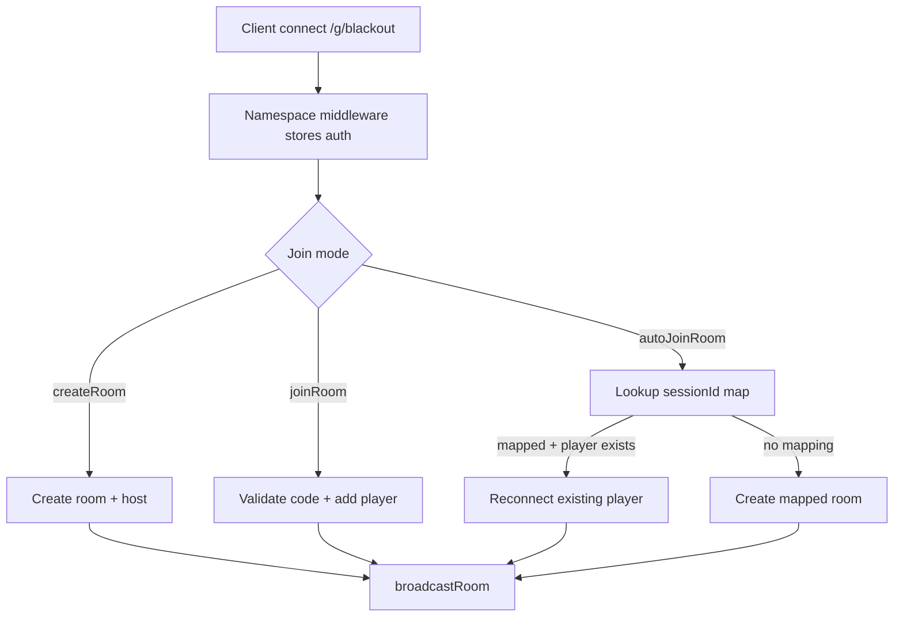
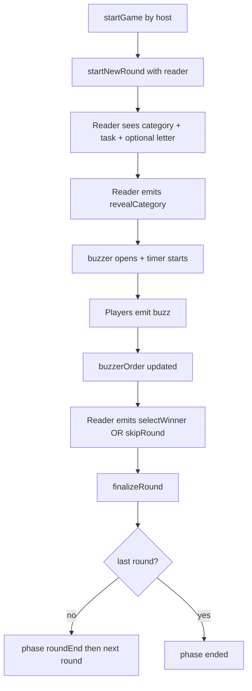
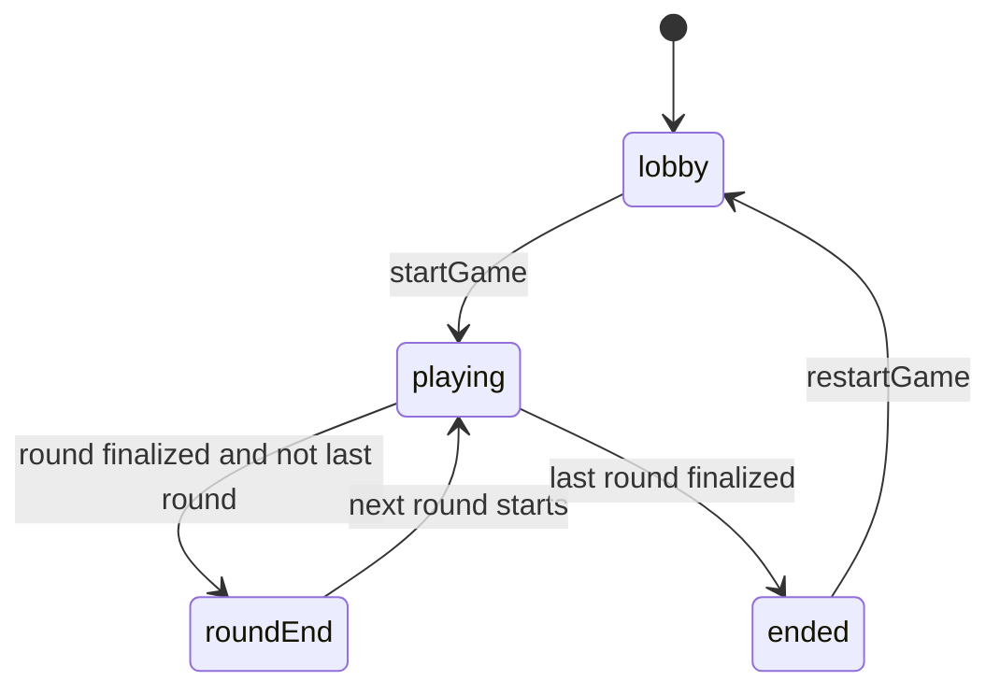

# Blackout Architecture

## High-level Overview

Blackout is split into shared contracts, a Socket.IO game server, and a Vue client.

```text
core (shared contracts)
  -> server (authoritative game state + transitions)
  -> ui-vue (rendering + user input + socket events)
```

Key design goals:

- one authoritative room state on server
- strict shared event/type contracts between client and server
- per-player sanitized room views
- explicit phase state machine

## Shared Core (`core/src`)

Shared modules have no runtime dependencies and are imported by both client and server.

- `types.ts`: room/player/round/phase models and room view DTOs
- `events.ts`: Socket.IO event contracts
- `constants.ts`: gameplay timings and limits

Core state model highlights:

- `Room.phase`: `lobby | playing | roundEnd | ended`
- `Room.language`: `de | en` (host configurable in lobby)
- `Room.excludedLetters`: host configurable letter blacklist
- `Room.currentRound`: active round payload
- `Room.roundHistory`: completed rounds
- `Room.usedCategoryLetterPairs`: uniqueness tracking for category/task/letter prompts

## Server Architecture (`server/src`)

### Models

- `models/room.ts`
  - in-memory room map
  - session-to-room mapping for embedded auto-join
  - cleanup timers for idle/ended rooms
- `models/player.ts`
  - player factory
  - socketId <-> player index mapping

### Managers

- `phaseManager.ts`: phase transitions only
- `roundManager.ts`: round lifecycle (start, reveal, buzz, finalize)
- `scoreManager.ts`: point updates, leaderboard, winner calculation
- `categoryManager.ts`: random category/task/letter prompt from SQLite
- `broadcastManager.ts`: per-player room sanitization + emits

### Socket Handlers

`socketHandlers.ts` wires all events for `/g/blackout`.

Responsibilities:

- parse handshake auth (`sessionId`, `joinToken`, `playerId`)
- validate input and permissions (host/reader checks)
- call managers and mutate room state
- broadcast sanitized state
- manage round timer and auto-advance

## Vue Client Architecture (`ui-vue/src`)

### State

`stores/game.ts` holds session and room data:

- current `RoomView`
- local player identity (`playerId`, `playerName`, `resumeToken`)
- derived getters (`isHost`, `isReader`, current phase)

### Socket layer

`composables/useSocket.ts` creates typed Socket.IO connection to `/g/blackout` and cleans up on unmount.

### UI composition

`App.vue` is the phase router:

- no room: landing screen
- `lobby`: setup and start
- `playing`: gameplay + buzzer
- `roundEnd`: short scoreboard
- `ended`: final winner screen

Panels (`Header`, `PlayersPanel`) remain visible when in a room.

## Socket.IO Event Flow

### Room lifecycle flow



### Round gameplay flow



## Phase Transition Flow



## Per-player State Sanitization

All state sent to clients is generated by `broadcastManager.toRoomView`.

Rules:

- remove internal player fields (`resumeToken`, `socketId`)
- show category/task/letter only when:
  - player is current reader, or
  - round already revealed
- emit personalized `RoomView` per player socket

Example behavior before reveal:

```ts
const isReader = round.readerId === playerId;
const showPrompt = isReader || round.revealed;

return {
  category: showPrompt ? round.category : null,
  task: showPrompt ? round.task : null,
  letter: showPrompt ? round.letter : null,
};
```

## Standalone Runtime Notes

- `standalone-server/src/staticDir.ts` resolves the static directory in this order:
  1. `dist/standalone-web` (preferred for `start:standalone` if present)
  2. `dist/client`
  3. `dist/standalone-web`
  4. `ui-vue` (dev fallback)
- `standalone-server/src/index.ts` serves `/health` and SPA fallback while skipping `/socket.io`.

## SQLite and Build Notes

- Runtime DB path defaults to `server/src/db/blackout.sqlite` (`DB_PATH` can override it).
- DB schema lives in `server/src/db/schema.sql`.
- Default content lives in CSV files under `server/src/db/data/`.
- On startup, missing or empty tables are initialized from those CSV files.
- `pnpm build:standalone-server` runs:
  - TypeScript compile (`tsc -p standalone-server/tsconfig.json`)
  - `node scripts/copy-db-assets.mjs` to copy DB assets into dist for runtime startup.
